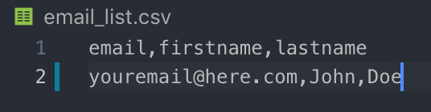
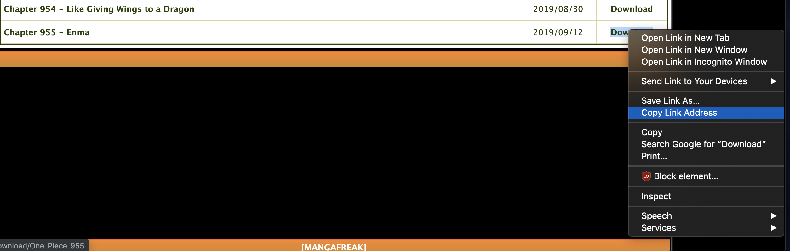

## Manga Fetcher
Manga Fetcher is a script that will scrape a website that posts Manga and download new releases when it finds them and send them to you.

## Usage
In order to use the script, you must follow the steps below.

1. Clone the repository
'''bash
git clone https://github.com/eriyezab/manga_fetcher.git
'''

2. You will need to have a gmail account and set up an app password. Follow this tutorial: https://www.youtube.com/watch?v=ndxUgivCszE

3. Once you have set that up, you must open app.py and change the variables EMAIL_ADDRESS and EMAIL_PASSWORD to the email address and password that you just set up. This will be the email that sends you the chapters. This can be the same as the email you want to receive the chapters on if you want or you can use a different email.

'''python

'''

4. Open email_list.csv and add the email you would like to receive the manga chapters on followed by your first and last name

5. Open manga_list.csv and you will see a default list of Manga that will be checked for and sent to you. If you want to add more,simply find the link to the page on mangafreak that posts all the chapters of that manga and then navigate to the bottom of the list and copy the dowload link of the most recent chapter

6. Once you have done all this, you can now run the app and it will check to see if there was any new releases for the mangas you have in mange_list.csv. I highly suggest deploying this to a platform that will run scheduled tasks for you so that you don't have to manually run the program. I personally used PythonAnywhere (https://www.pythonanywhere.com) to deploy this app.